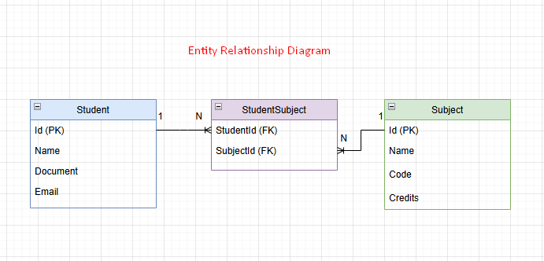

# Q10 Solution

## Descripción
Esta es una aplicación Web desarrollada con .NET 9, con vistas en Razor Pages y estilos en Bootstrap para gestionar estudiantes y materias.  
Permite crear, editar y listar estudiantes y materias, asignar materias a los estudiantes.

## Funcionalidades principales
- CRUD de estudiantes y materias.
- Asignar materias a estudiantes.
- Validación de negocio: un estudiante **no puede inscribir más de 3 materias con más de 4 créditos**.
- Pruebas unitarias para servicios.
- Interfaz limpia con Bootstrap.

## Requisitos
- .NET 9 SDK o superior.
- Visual Studio 2022 o superior.

## Cómo ejecutar
1. Clonar el repositorio:
   git clone https://github.com/julianatehortua/Q10TechnicalTest.git

2. Compilar la aplicación:
   dotnet build

3. Ir la carpeta de la aplicación web:
   cd Q10Solution.Web

4. Ejecutar la aplicación:
   dotnet run

5. Abre el navegador para probar la aplicación:
   http://localhost:5209/ (o el puerto que indique)

## Estructura del Proyecto

- `Q10Solution.Web/`: Proyecto web MVC principal (controladores, configuración).
- `Q10Solution.Application/`:  DTOs e interfaces de servicios.
- `Q10Solution.Domain/`: Entidades principales.
- `Q10Solution.Infrastructure/`: Acceso e inicialización de datos y servicios.
- `Q10Solution.Tests/`: Pruebas unitarias con xUnit.
- `docs/`: Documentación y recursos como el diagrama ERD.

## Base de datos y datos de prueba
Use una base de datos SQLite que se guarda de forma local para simplificar las pruebas y el despliegue.

Al iniciar la aplicación, un DataSeeder inserta datos de ejemplo
- 10 materias.
- 5 estudiantes con materias asignadas.

## Pruebas
- Incluye pruebas unitarias para servicios de estudiantes y materias.
- Utiliza Moq para mocks y xUnit para validaciones.

## Esquema de la Base de Datos

A continuación se presenta el diagrama de entidades y relaciones utilizado en la solución:

Gracias por revisar mi prueba técnica!